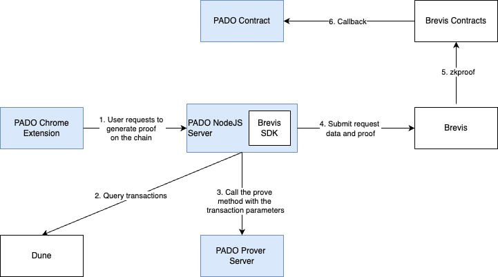

# pado-brevis-onchain-transaction
This repository is used to prove that a wallet address at bsc mainnet has transactions since July 1, 2024.

## app
1. Get the latest transaction from bsc mainnet
2. Call Brevis backend service and submit the transaction proof

## contracts
The app contract is called after you submit proof is submitted to Brevis when Brevis' systems submit the final proof on-chain. It does the following things when handling the callback:
1. checks the proof was associated with the correct vk hash
2. decodes the circuit output
3. emit a simple event

## prover
Generate proof for the transaction
